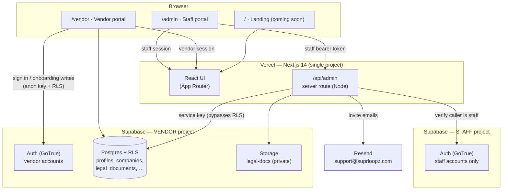
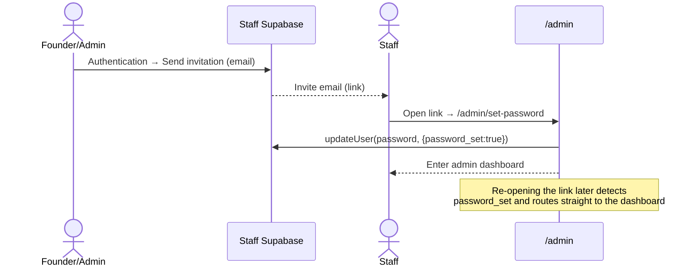
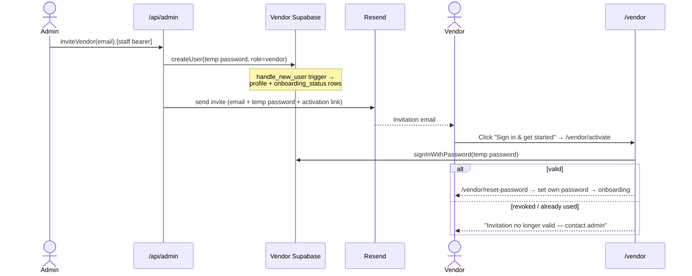
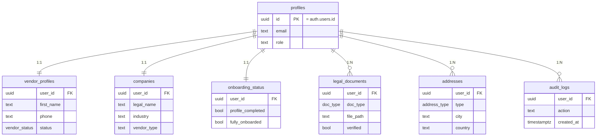

<div align="center">

# Suprloopz — Vendor Onboarding

**Multi-tenant B2B vendor onboarding platform.**
Staff invite vendors; vendors self-onboard through a guided, document-backed flow; staff review and approve.

[**suprloopz.com**](https://suprloopz.com) · `/admin` (staff) · `/vendor` (vendors)

`Next.js 14` · `Supabase` · `Resend` · `Vercel`

</div>

---

## Table of contents

- [Overview](#overview)
- [System architecture](#system-architecture)
- [The two-system model](#the-two-system-model)
- [Authentication & authorization](#authentication--authorization)
- [Core flows](#core-flows)
  - [Staff onboarding](#1-staff-onboarding)
  - [Vendor invitation & activation](#2-vendor-invitation--activation)
  - [Document review](#3-document-review)
- [Data model](#data-model)
- [Admin API surface](#admin-api-surface)
- [Project structure](#project-structure)
- [Local development](#local-development)
- [Environment variables](#environment-variables)
- [Supabase setup](#supabase-setup)
- [Email & deliverability](#email--deliverability)
- [Deployment](#deployment)
- [Security model](#security-model)
- [Design decisions](#design-decisions)

---

## Overview

Suprloopz Vendor Onboarding is the system that brings third-party vendors onto the
Suprloopz platform. It serves two distinct audiences from a single deployment:

| Audience | Portal | What they do |
|---|---|---|
| **Internal staff** | `suprloopz.com/admin` | Invite vendors, review submitted data & legal documents, verify/reject documents, set vendor status, manage pending invites. |
| **Vendors** | `suprloopz.com/vendor` | Accept an invite, set a password, and complete onboarding: **Profile → Company → Legal documents → Address**. |

The bare root (`suprloopz.com/`) is a placeholder landing page until the marketing
site ships.

The platform is **serverless and managed end-to-end** — there is no application
server to operate. Next.js (UI + a thin server route layer) runs on Vercel;
Supabase provides authentication, Postgres, and object storage; Resend handles
transactional email.

---

## System architecture



**Reading the diagram**

- **Vendors** talk to the **vendor** Supabase project directly with the public
  anon key; **Row Level Security** ensures they only ever touch their own rows.
- **Staff** never touch vendor data directly. The admin UI calls the server route
  **`/api/admin`**, which (a) verifies the caller is a real staff user against the
  **staff** project, then (b) performs the operation against the **vendor** project
  with the service key (which bypasses RLS). This keeps the privileged key on the
  server only.

---

## The two-system model

Staff and vendors live in **two completely separate Supabase projects**. This is a
deliberate isolation boundary, not just a table split:

| | Vendor project | Staff project |
|---|---|---|
| Holds | Vendor auth + all vendor data + `legal-docs` storage | Staff auth only (no tables) |
| Authenticated by | `/vendor` portal (`lib/supabase.js`) | `/admin` portal (`lib/supabaseStaff.js`) |
| Account creation | Invited from inside the admin app | Added via the Supabase dashboard |
| Role meaning | Tagged `role = 'vendor'` | Every account is staff by definition |

**Why two projects?** So the **same email address can be both a staff member and a
vendor** as fully independent accounts, with separate credentials, separate
sessions, and zero data bleed. The two browser clients use different storage keys
(`sb-<project-ref>-auth-token`), so their sessions never collide.

---

## Authentication & authorization

- **Auth flow: implicit** (not PKCE). Server-generated invite/recovery email links
  establish a session client-side; PKCE would break because the browser never
  initiated the flow.
- **Vendor data access (RLS).** Every vendor table has `FORCE ROW LEVEL SECURITY`.
  Policies allow a row when `user_id = auth.uid()` **or** `is_staff()`. Helper
  functions read the JWT:
  - `jwt_role()` → the `app_metadata.role` claim.
  - `is_staff()` → `auth.uid() is not null and jwt_role() <> 'vendor'`.
- **Staff authorization (server-side).** The admin API never trusts the client's
  claim of being staff. `verifyStaff(req)` validates the bearer token against the
  **staff** project's GoTrue (`auth.getUser(token)`); only a valid staff user
  proceeds. All data work then runs with the **vendor** service key.
- **Acceptance signal.** A vendor is considered to have "accepted" once they have
  signed in at least once (`auth.users.last_sign_in_at`). Un-accepted invites are
  surfaced separately and can be revoked.

---

## Core flows

### 1. Staff onboarding



### 2. Vendor invitation & activation



Onboarding then walks the vendor through **Profile → Company → Legal documents
→ Address**, each step persisting via the vendor client (RLS-scoped) and advancing
`onboarding_status`. Files upload to the private `legal-docs` bucket under
`{user_id}/{doc_type}/{filename}`.

### 3. Document review

Staff open a vendor in `/admin/vendors/[id]`. Legal documents render inline via an
in-app PDF viewer using **short-lived signed URLs** (the bucket is private; URLs are
minted server-side per request). Staff verify or reject each document, and set the
vendor's status (`pending` / `active` / `suspended`). A polling-based notification
layer raises a toast + bell badge when a vendor accepts an invite.

---

## Data model

All tables live in the **vendor** project. `profiles` mirrors `auth.users`; every
other table keys off `user_id`.



- **Enums:** `vendor_status (pending|active|suspended)`, `doc_type (GST|PAN|CIN)`,
  `address_type (registered|billing|shipping)`.
- **`handle_new_user()` trigger** (on `auth.users` insert): tags the profile role
  and, for vendors, seeds the `onboarding_status` row.
- **RLS:** own-row-or-staff on every table; inserts restricted to `user_id = auth.uid()`.

---

## Admin API surface

Single consolidated route — `POST /api/admin` with an `action` discriminator. Every
call is gated by `verifyStaff` and runs against the vendor project with the service key.

| Action | Purpose |
|---|---|
| `list` | All vendors + dashboard stats (accepted vs invited split) |
| `get` | One vendor's full record + pre-signed document URLs |
| `inviteVendor` / `inviteVendors` | Create + email one or many vendor invites |
| `resendInvite` | New temp password + re-send the invite email |
| `deleteVendor` | Revoke/delete a vendor (DB cascade removes all rows) |
| `setStatus` | Set `pending` / `active` / `suspended` |
| `verifyDoc` / `rejectDoc` | Approve or reject a legal document |
| `signedUrl` | Mint a short-lived signed URL for a stored file |

The client never calls Supabase admin APIs directly — it goes through
`lib/adminApi.js`, which attaches the staff session token.

---

## Project structure

```
frontend/                              # the live application (everything runs here)
├─ src/app/
│  ├─ page.jsx                         # "/" coming-soon landing
│  ├─ admin/                           # staff portal
│  │  ├─ page.jsx                      #   dashboard (stats, Active/Invited tabs, notifications)
│  │  ├─ vendors/ , vendors/[id]/      #   vendor list + detail (doc viewer, verify/reject, status)
│  │  ├─ login/ , set-password/        #   staff auth
│  │  └─ layout.jsx                    #   guard + AdminDataProvider + bell/toaster
│  ├─ vendor/                          # vendor portal
│  │  ├─ activate/ , reset-password/   #   invite landing + set own password
│  │  ├─ onboarding/{profile,company,legal,address}/
│  │  └─ login/ , dashboard/
│  └─ api/admin/route.js               # staff-gated server admin API
├─ src/lib/
│  ├─ supabase.js , supabaseStaff.js   # vendor & staff browser clients
│  ├─ serverSupabase.js                # server clients + verifyStaff gate
│  ├─ auth.jsx                         # path-aware auth context (/admin → staff, else vendor)
│  ├─ adminApi.js                      # client → /api/admin helper
│  ├─ adminData.jsx                    # polling provider: vendors, stats, notifications, toasts
│  ├─ db.js                            # vendor-side data writes (RLS-scoped)
│  ├─ email.js                         # Resend invite email (HTML + text)
│  └─ routes.js                        # single source of truth for paths
├─ src/components/admin/               # invite dialog, invited actions, notifications
└─ scripts/*.mjs                       # one-off operator utilities (GoTrue/PostgREST via service key)

supabase/schema.sql                    # vendor project: tables, RLS, trigger, legal-docs bucket
backend/ infra/ deploy/ docker-compose.yml   # LEGACY — abandoned self-hosted stack, not used
```

---

## Local development

```bash
cd frontend
npm install
npm run dev          # http://localhost:3001
```

Requires `frontend/.env.local` (gitignored) populated with the variables below.

---

## Environment variables

```bash
# Vendor Supabase project
NEXT_PUBLIC_SUPABASE_URL
NEXT_PUBLIC_SUPABASE_ANON_KEY
SUPABASE_SECRET_KEY                # server-only (RLS bypass)

# Staff Supabase project
NEXT_PUBLIC_STAFF_SUPABASE_URL
NEXT_PUBLIC_STAFF_SUPABASE_ANON_KEY
STAFF_SUPABASE_SECRET_KEY          # server-only (verify staff tokens)

# App + email
NEXT_PUBLIC_SITE_URL               # https://suprloopz.com
RESEND_API_KEY                     # server-only
RESEND_FROM_EMAIL                  # Suprloopz <support@suprloopz.com>
```

Set the same values in **Vercel → Settings → Environment Variables** (Production +
Preview). **Redeploy after any change** — env updates don't apply to a running deployment.

---

## Supabase setup

1. Run [`supabase/schema.sql`](supabase/schema.sql) in the **vendor** project's SQL
   editor (tables, RLS, `handle_new_user` trigger, `legal-docs` bucket + policy).
2. **Auth → URL Configuration** per project:
   | Project | Site URL | Redirect URLs |
   |---|---|---|
   | Staff | `https://suprloopz.com/admin/set-password` | `https://suprloopz.com/**` |
   | Vendor | `https://suprloopz.com/vendor` | `https://suprloopz.com/**` |
3. Disable public sign-ups on both (accounts are invite/dashboard-created).

---

## Email & deliverability

`suprloopz.com` is verified in Resend with **SPF, DKIM, and a single DMARC** record
(via GoDaddy). Invite emails send from **`Suprloopz <support@suprloopz.com>`** to any
recipient, as a multipart HTML + plain-text message (plain-text alternative and a
real `reply-to` improve inbox placement).

---

## Deployment

Push to `main` → **Vercel auto-builds and deploys `frontend/`** to `suprloopz.com`.
There is nothing else to deploy — Supabase and Resend are fully managed. DNS:
GoDaddy apex `A @ → 216.198.79.1` points the domain at Vercel; email DNS records
stay on the same zone.

---

## Security model

- **Privileged keys never reach the browser.** Service keys are used only inside
  `/api/admin` (server runtime). The client holds only public anon keys.
- **Defense in depth on vendor data.** RLS enforces per-vendor isolation even if a
  client is compromised; staff access is additionally gated server-side by
  `verifyStaff`.
- **Private document storage.** The `legal-docs` bucket is non-public; files are
  reachable only through short-lived signed URLs minted server-side.
- **Single-use temporary credentials.** Invite temp passwords are replaced on first
  sign-in; revoking an invite deletes the account, instantly invalidating its link.
- **Tenant isolation by construction.** Staff and vendor identities live in separate
  Supabase projects — a vendor token is meaningless to the staff project and vice versa.

---

## Design decisions

- **Two Supabase projects over one.** Enables the same email to be both staff and
  vendor, and gives a hard isolation boundary between internal and external identities.
- **Admin-created temp password over magic links.** Lets staff invite vendors with a
  branded Resend email and a deterministic activation link, and supports resend/revoke.
- **Acceptance = first sign-in.** A zero-extra-state signal (`last_sign_in_at`) that
  cleanly separates "invited" from "active" without a status column to maintain.
- **Polling notifications over realtime.** Simpler and robust for a small staff
  audience; no cross-project realtime subscriptions to manage.
